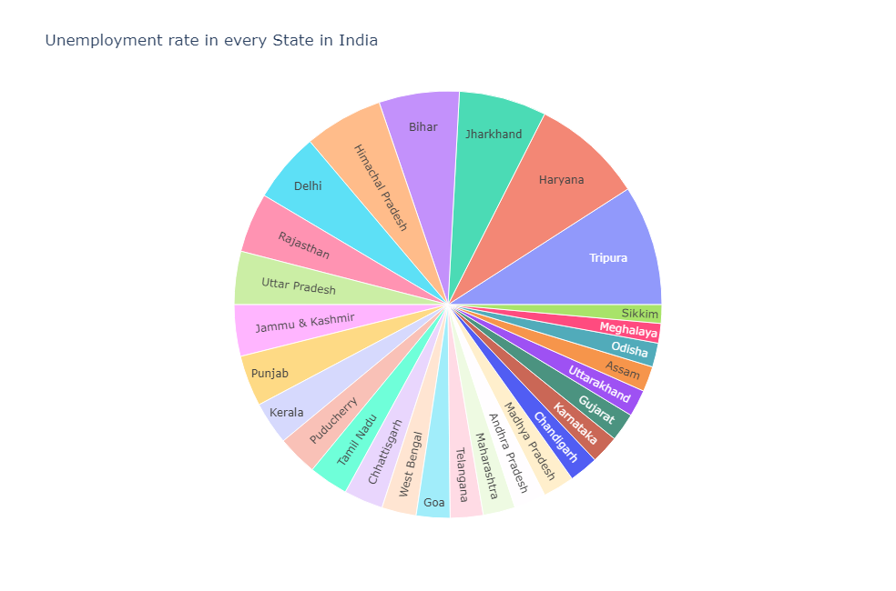

<h1 align = "center"> Unemployment-Analysis-With-Python </h1>


## 📝 Description
This project aims to analyze the unemployment data of a India and create visualizations to help understand the trends and patterns in the data. The project uses Python libraries such as Pandas, Matplotlib, and NumPy for data manipulation and visualization.

## ⏳Dataset

Download the dataset for custom training [data](data/) . 

The data is stored in a CSV file in the data directory. The CSV file contains the following columns:
- Region
- Date	
- Frequency	
- Estimated Unemployment Rate (%)	
- Estimated Employed	
- Estimated Labour Participation Rate (%)	
- Area

## 🛠️Installation and Usage

1. Clone this repository to your local machine:
```
git clone https://github.com/usmanbvp/Unemployment-Analysis-With-Python.git
```
2. Install the required Python libraries using the following command:
``` 
pip install -r requirements.txt
```
3. Open the Jupyter notebook in the project cloned folder, by running:
```
jupyter notebook
```

4. Inside the notebooks folder, you will find the Unemployment_analysis_with_python.ipynb. Open it.

5. Run the cells one by one  in the notebook to visualize the patterns of data.



## 🗒️License

This project is licensed under the [MIT License](LICENSE). 
The MIT License is a permissive open source license that allows you to use, modify, and distribute this project for both commercial and non-commercial purposes.
